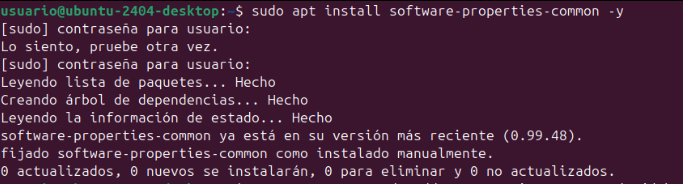
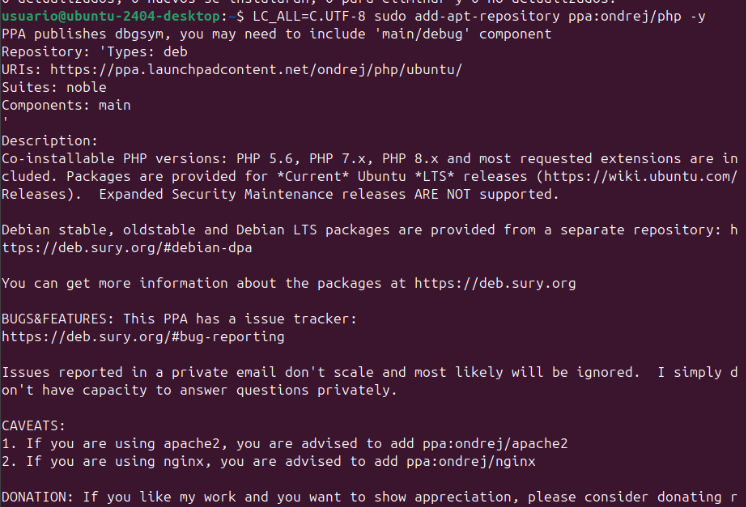
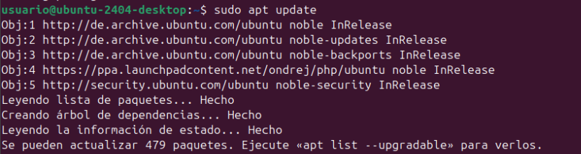
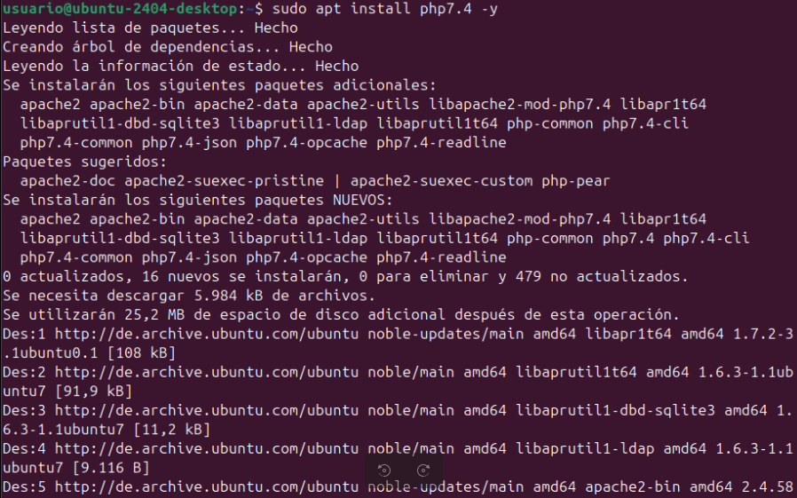
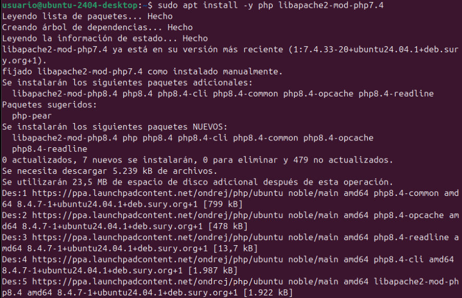
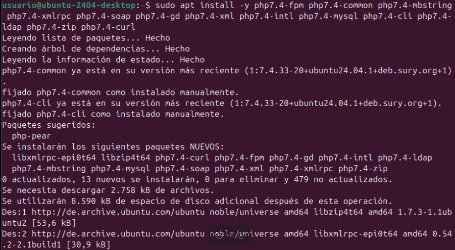
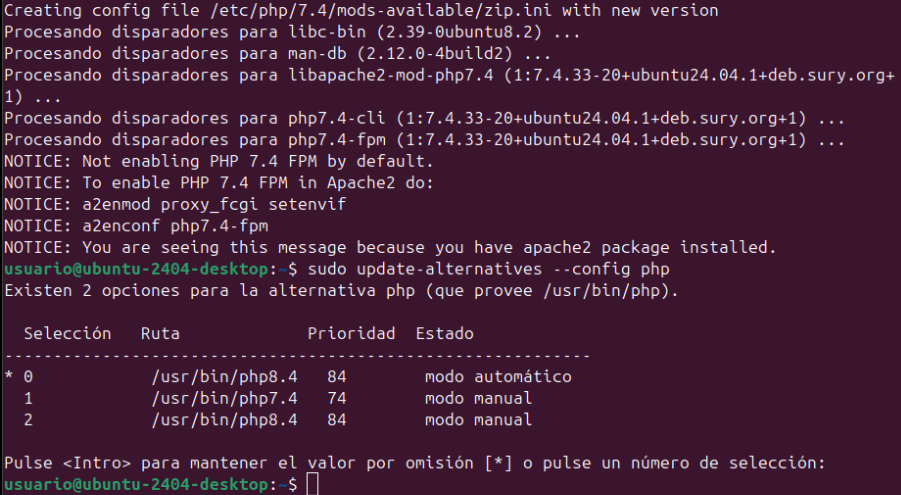
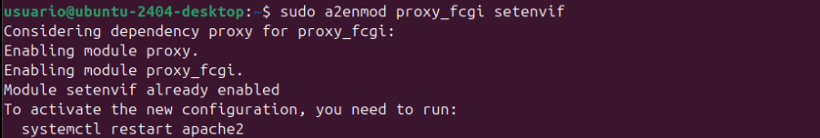
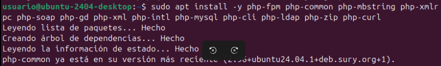

# 📘 Manual d'Instal·lació d'una Aplicació Web amb Apache2, MySQL i PHP

Aquest manual descriu el procés per instal·lar una aplicació web dins d'un contenidor Linux (o màquina virtual) utilitzant **Apache2**, **MySQL** i **PHP**, amb la configuració i permisos adequats.

Tendrás que empezar por este comando 
sudo apt install software-properties-common -y

LC_ALL=C.UTF-8 sudo add-apt-repository ppa:ondrej/php -y

sudo apt update

sudo apt install php7.4 -y

sudo apt install -y php libapache2-mod-php7.4

sudo apt install -y php7.4-fpm php7.4-common php7.4-mbstring php7.4-xmlrpc php7.4-soap php7.4-gd php7.4-xml php7.4-intl php7.4-mysql php7.4-cli php7.4-ldap php7.4-zip php7.4-curl

sudo update-alternatives --config php

sudo a2enmod proxy_fcgi setenvif

sudo a2enconf php7.4-fpm

sudo service apache2 restart

