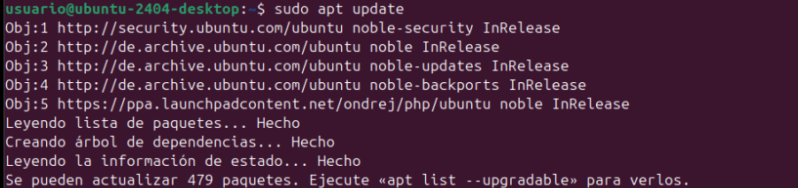
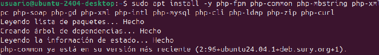

# 📘 Manual d'Instal·lació d'una Aplicació Web amb Apache2, MySQL i PHP

Aquest manual descriu el procés per instal·lar una aplicació web dins d'un contenidor Linux (o màquina virtual) utilitzant **Apache2**, **MySQL** i **PHP**, amb la configuració i permisos adequats.

---

## 1️⃣ Instal·lació de PHP 7.4 a Ubuntu 24.04

### Pas 1: Instal·lar els requisits previs de PPA

```bash
sudo apt install software-properties-common -y
```


### Pas 2: Afegir el repositori de PHP 7.4

```bash
LC_ALL=C.UTF-8 sudo add-apt-repository ppa:ondrej/php -y
```


### Pas 3: Actualitzar els repositoris

```bash
sudo apt update
```


### Pas 4: Instal·lar PHP 7.4

```bash
sudo apt install php7.4 -y
```


### Pas 5: Instal·lar PHP i el mòdul per Apache

```bash
sudo apt install -y php libapache2-mod-php7.4
```


### Pas 6: Instal·lar extensions de PHP

```bash
sudo apt install -y php7.4-fpm php7.4-common php7.4-mbstring php7.4-xmlrpc php7.4-soap php7.4-gd php7.4-xml php7.4-intl php7.4-mysql php7.4-cli php7.4-ldap php7.4-zip php7.4-curl
```


### Pas 7: Configurar la versió de PHP per defecte

```bash
sudo update-alternatives --config php
```


### Pas 8: Activar mòduls d'Apache

```bash
sudo a2enmod proxy_fcgi setenvif
```


```bash
sudo a2enconf php7.4-fpm
```


### Pas 9: Reiniciar Apache2

```bash
sudo service apache2 restart
```


Ahora la instalación de owncloud

sudo apt update


sudo apt upgrade


sudo apt install -y apache2


sudo apt install -y mysql-server


sudo apt install -y php libapache2-mod-php


sudo apt install -y php-fpm php-common php-mbstring php-xmlrpc php-soap php-gd php-xml php-intl php-mysql php-cli php-ldap php-zip php-curl


sudo systemctl restart apache2


sudo mysql


Tendras que continuar con estos comandos
CREATE DATABASE bbdd;
CREATE USER 'usuario'@'localhost' IDENTIFIED WITH mysql_native_password BY 'password';
GRANT ALL ON bbdd.* to 'usuario'@'localhost';
exit


Y tambien tendras que poner estos:

sudo cp ~/Baixades/app-web.zip /var/www/html
cd /var/www/html
sudo unzip app-web.zip
sudo cp -R app-web/. /var/www/html
sudo rm -rf app-web/
sudo rm -rf /var/www/html/index.html
sudo rm -rf /var/www/html/index.html
 
